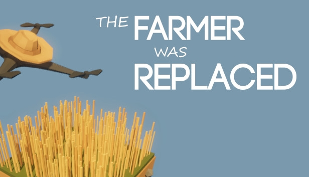

# The Farmer Was Replaced

Es un *videojuego* en el que el jugador automatiza una granja programando un dron utilizando un lenguaje similar a **Python**.

El objetivo es programar un dron para que realice tareas repetitivas de agricultura, permitiendo al jugador **mejorar sus habilidades de programación** y optimizar el proceso de producción para desbloquear nueva tecnología y recursos.
